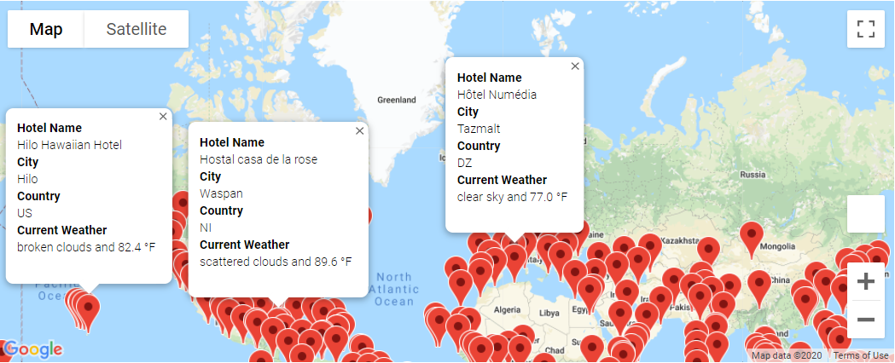

# World Weather Analysis
*An API World Weather Analysis*

## Project Overview

In this project I put together beta version of an application for potential travel technology services that specializes in hotel and logging industry. The application collects and presents data for customers via the search page that can be filtered based on preferred travel criteria in order to find their ideal hotel anywhere in the world. 

The project consists with three modules:

### 1. Weather Database
In this module I used **NumPy** random module to retrieve 2000 random coordinates (latitudes and longitudes) and **CityPy** module to define closest city names based on these coordinates. Once city names were stored in a list, I used **Open Weather APIs** to request json weather data from a web. After cleaning the data, final results were transformed into Pandas Data Frame and stored in CSV file.

  

  
Pandas data frame with the data from Open Weather API.

### 2. Vacation Search
In this module I used **input** function to take and store potential customer preferred minimum and maximum temperature. Based on this input I used Pandas **loc** method on Weather Database file to filter the data. Next, I used **Google Maps APIs** to retrieve hotel names. After cleaning the data, the data frame was exported to CSV file. With the **Jupyter gmaps module** I plotted map with pop-up message that include hotel name, city, county and weather information.

  

  
Map by Google Maps with pop-up message with hotel and weather information.

### 3. Vacation Itinerary
In this module I selected 4 hotel destination that potential customers might like to use for their trip planning. Based on selection I extracted coordinates with **to_numpy()** function and used **Google Directions API** to connect and mark those points via selected traveling mode (driving).

  
 

  
Map by Google Directions with 4 connecting points and Google Map with pop-up message with hotel and weather information.

## Resources 

- Software
    -	Jupyter Notebook
- Enviroment
    -	Python 3.7
- Dependencies
    -	Pandas Library
    -	Numpy Library 
    -	CitiPy Module
    -	Python Requests
- APIs
    -	**Open Weather APIs** to retrieve weather data.
    -	**Google Maps API** to create heat maps and retrieve information about hotels around the world.
    -	**Google Directions API** to map the direction between 4 points.

## Techniques used

-	NumPy random module to generate random coordinates.
-	CityPy module to search for city names based on random coordinates.
-	Retrieve and use data from an API "get" request to a server.
-	Retrieve and store values from a JSON array.
-	Use try and except blocks to resolve errors.
-	Create heatmaps, and add markers using the Google Maps API.
-	Create destination layer map using Google Direction API.
-	Pandas to create data frames and clean the data.
-	Take user input and select data base on user input.
-	Python enumerate function.
-	Creating heat maps and pop-up boxes that displays information about hotels and weather.
-	Json traversals.
